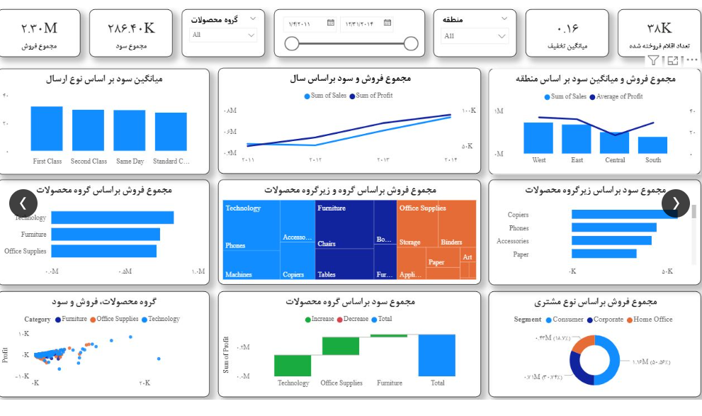
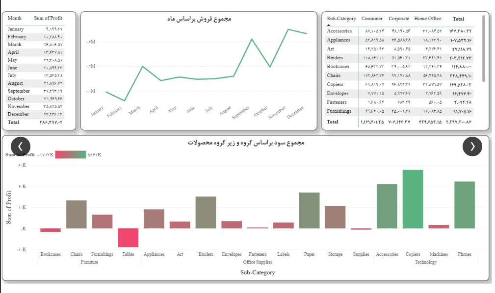
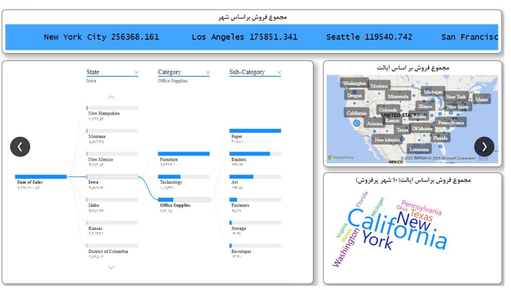

# 📊 Superstore Sales & Profitability Analytics Dashboard

یک داشبورد هوش تجاری جامع طراحی شده در Power BI برای تحلیل عملکرد فروش، سودآوری محصولات و رفتار مشتریان بر اساس دیتاست استاندارد Superstore (با بیش از ۱۰,۰۰۰ رکورد تراکنش). این پروژه با هدف شناسایی گلوگاه‌های ضررده، تحلیل روند فروش و کشف الگوهای خرید مشتریان در مناطق جغرافیایی مختلف پیاده‌سازی شده است.

## 📈 شاخص‌های کلیدی عملکرد (KPIs)
* **مجموع فروش (Total Sales):** ۲.۳ میلیون دلار
* **مجموع سود (Total Profit):** ۲۸۶.۴ هزار دلار
* **تعداد اقلام فروخته شده (Total Quantity):** ۳۸ هزار عدد
* **میانگین تخفیف (Average Discount):** ۱۶٪
---

## 📂 ساختار داشبورد

داشبورد به سه صفحه اصلی تقسیم شده است که هر کدام به یک جنبه خاص از کسب‌وکار می‌پردازند:

### ۱. خلاصه مدیریتی (Executive Summary)
این صفحه یک نمای کلی از عملکرد سیستم ارائه می‌دهد.
* بررسی روند فروش و سود سالانه.
* تفکیک فروش و سود بر اساس گروه‌های محصولی (تکنولوژی، مبلمان، لوازم اداری) و سگمنت‌های مشتریان.
* تحلیل میانگین سود بر اساس روش‌های ارسال (First Class, Standard و...).



### ۲. تحلیل سودآوری و هوش زمانی (Profitability & Time Intelligence)
این بخش به صورت عمیق به بررسی سود و زیان می‌پردازد.
* تحلیل روند ماهانه فروش و سود.
* شناسایی سریع محصولات زیان‌ده با استفاده از فرمت‌دهی شرطی (Conditional Formatting). 
* **بینش کلیدی:** با وجود فروش بالای دسته مبلمان، زیرگروه «میزها» (Tables) به شدت زیان‌ده است و حاشیه سود کل را کاهش داده است. در مقابل، دسته تکنولوژی (تلفن و دستگاه‌های کپی) بیشترین سود را تولید می‌کند.



### ۳. تحلیل جغرافیایی و ریشه‌یابی (Geographical & Root Cause Analysis)
* استفاده از نقشه و Word Cloud برای شناسایی مناطق پرفروش.
* بهره‌گیری از **Decomposition Tree** برای شکستن درآمد از سطح ایالت به دسته‌بندی و زیرگروه‌های محصول جهت ریشه‌یابی دقیق فروش.
* **بینش کلیدی:** ایالت‌های کالیفرنیا و نیویورک قلب تپنده فروش شرکت هستند.



---

## 💻 نمونه کدهای DAX (Measures)

بخشی از مژرهای کلیدی نوشته شده در این پروژه:

```dax
// محاسبه مجموع فروش
Total Sales = SUM(FactSales[Sales])

// محاسبه مجموع سود
Total Profit = SUM(FactSales[Profit])

// محاسبه میانگین سود
Average Profit = AVERAGE(FactSales[Profit])
